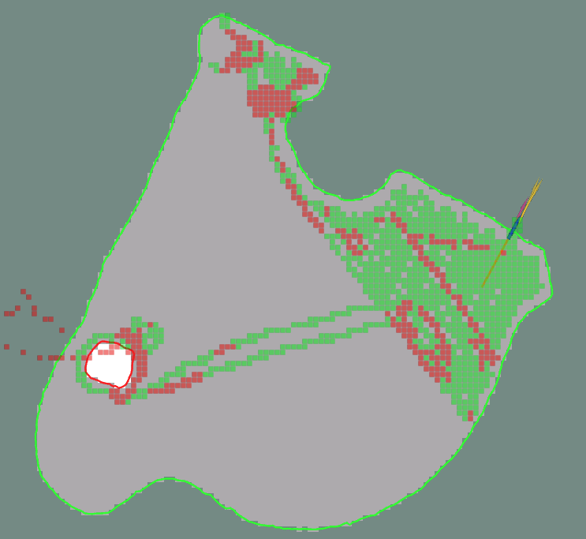

# MowgliRViz

Is a data collector that taps into existing topics like /odom or /ublox/navpt to gather information "at" the bots current location and feed that into a GridMap



## Compiling

There are two versions one for stock OM (as of Sept 2022) and one for Mowgli. 
The difference is that the Mowgli version supports topics and data exports that Mowgli provides which OM at the moment does not (feel free to submit pull reqs for the OM version)

For Mowgli:

```
~/MowgliBase/scripts/build_mowgli_rviz.sh
```

For OpenMower

```
~/MowgliBase/scripts/build_om_rviz.sh
```

## Get started 

As mowgli_rviz does not know the mowing area, you need to supply it the map.bag file from ~/.ros/map.bag on your Bot at least once. 

Just copy the file to ~/.ros/map.bag (if you run MowgliBase and MowgliRover on the same Raspi you dont need to do anything extra.)

Start mowgli_rviz with

```
~/MowgliBase/scripts/rviz.sh
```

After the inital map.bag has been captured, the file ~/.ros/mowgli_map.bag is created with "layers" of additional information, the original map.bag is stored as "mowing_area" layer.

Other layers are current "gps_rtk_fix_type" and "gps_xy_acc".

If you want to reset your collected data you need to delete ~/.ros/mowgli_map.bag

### Layer: gps_rtk_fix_type

   0.5 = RTK FIX (good)

   1.0 = RTK FLOATING FIX (bad)

   *Higher (worse) datapoints overwrite lower (good) datapoints, so you'll get a map of where GPS is worst* 

### Layer: gps_xy_acc

   \<value\> = /ublox/navpvt/hAcc - Horizontal Accuracy in cm 

   *Higher (worse) datapoints overwrite lower (good) datapoints, so you'll get a map of where GPS is worst*

## Configuration

   GridMap is configured in **~/MowgliBase/src/mowgli_rviz/config/mowgli.yaml**
   
   (Check [GridMap Filters](https://github.com/ANYbotics/grid_map#grid_map_filters) for cool filtering options.)

   The .launch file supports the following parameters

   **openmower_map_path** (default ~/.ros/map.bag)
   **mowgli_map_path** (default  ~/.ros/mowgli_map.bag )

## TODO

 * Only supports one "mowing_area" at the moment, no nav areas are visualized either
 * Get that data via a service instead of having to copy map.bag around 
 * More data layers (Battery Voltage, Current, IMU Data (bumpiness), Motor currents, ... 
